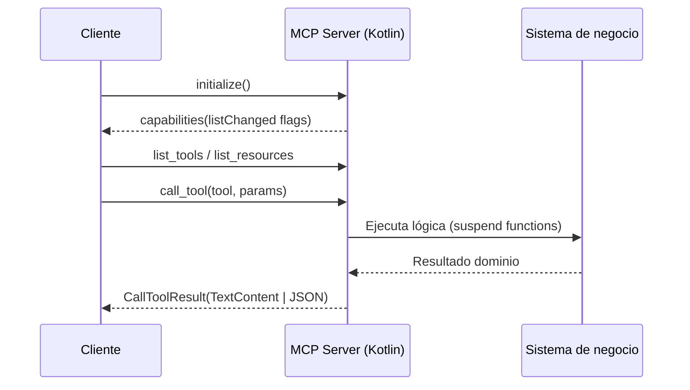

# MCPs en Kotlin
## Diseñando agentes conectados con MCP

---
layout: about-me

helloMsg: ¡Hola Aranjuez!
name: Antonio Leiva
nameTitle: Formador DevExpert
imageSrc: ./assets/antonio-leiva.jpg
position: left
job: Formador DevExpert
social1: 🐦 @devexpert_io
social2: 🎥 @devexpert-io
social3: 🌍 https://devexpert.io
---

---
layout: default
---
# Agenda

1. ¿Por qué MCP y por qué ahora?
2. Fundamentos del protocolo
3. Kotlin + MCP en la JVM
4. Caso 1: Play Store MCP Server
5. Caso 2: Listmonk MCP Server
6. Buenas prácticas y despliegue
7. Recursos y Q&A


<!--
Marca el timebox: ~5 min por bloque, 10 min demo combinada. Explica que habrá resumen y recursos al final.
-->

---

# El dolor que resuelve MCP

<div class="grid h-100 w-full max-w-5xl mx-auto gap-8 md:grid-cols-2 place-content-center text-left">
  <div class="rounded-xl border border-red-500/40 bg-red-900/20 p-6">
    <div class="text-lg font-semibold tracking-wider text-red-300">EL DOLOR</div>
    <ul class="mt-4 space-y-3 text-sm leading-snug opacity-90">
      <li>❌ Conectar LLMs con sistemas es <strong>repetitivo y frágil</strong>.</li>
      <li>❌ Cada integración <strong>reinventa</strong> transporte, auth y contratos.</li>
      <li>❌ Difícil de <strong>escalar y mantener</strong> entre distintos modelos y plataformas.</li>
    </ul>
  </div>
  <div v-click class="rounded-xl border border-green-500/40 bg-green-900/20 p-6">
    <div class="text-lg font-semibold tracking-wider text-green-300">LA SOLUCIÓN: MCP</div>
    <ul class="mt-4 space-y-3 text-sm leading-snug opacity-90">
      <li>✅ Un <strong>estándar abierto</strong> para conectar modelos a herramientas.</li>
      <li>✅ Como un "USB-C para la IA": <strong>unifica la comunicación</strong>.</li>
      <li>✅ Describe <strong>recursos, herramientas y prompts</strong> de forma universal.</li>
    </ul>
  </div>
</div>


<!--
Cita cómo Anthropic, Microsoft y la comunidad lo impulsan. Insiste en el beneficio para equipos Kotlin que ya consumen APIs.
-->

---

# Flujo MCP en alto nivel




<!--
Menciona handshake inicial y cómo `ServerCapabilities` informa al cliente sobre cambios. Esta slide marca la vista general previa a código.
-->

---

# Tools vs Resources vs Prompts

<div class="grid h-100 w-full max-w-5xl mx-auto gap-4 md:grid-cols-3 place-content-center text-left">
  <div class="rounded-xl border border-slate-200/60 bg-slate-800/30 p-5">
    <div class="text-sm font-semibold tracking-wider text-slate-200">TOOLS</div>
    <ul class="mt-3 space-y-2 text-sm leading-snug opacity-85">
      <li>El cliente pide que hagas algo concreto.</li>
      <li>Reciben parámetros definidos en un esquema.</li>
      <li>Devuelven un resultado estructurado.</li>
    </ul>
  </div>
  <div v-click class="rounded-xl border border-slate-200/60 bg-slate-800/30 p-5">
    <div class="text-sm font-semibold tracking-wider text-slate-200">RESOURCES</div>
    <ul class="mt-3 space-y-2 text-sm leading-snug opacity-85">
      <li>Datos que el servidor deja listos para leer.</li>
      <li>Se consultan con una URI usando `resources/read`.</li>
      <li>No cambian nada: solo dan contexto.</li>
    </ul>
  </div>
  <div v-click class="rounded-xl border border-slate-200/60 bg-slate-800/30 p-5">
    <div class="text-sm font-semibold tracking-wider text-slate-200">PROMPTS</div>
    <ul class="mt-3 space-y-2 text-sm leading-snug opacity-85">
      <li>Guiones que reusan instrucciones.</li>
      <li>El servidor devuelve mensajes listos para enviar.</li>
      <li>Pueden incluir texto y enlaces a recursos.</li>
    </ul>
  </div>
</div>


<!--
Detalles completos en la especificación MCP (tools/resources/prompts). Incluye: tools/list+call con JSON Schema, resources/list/read/subscribe para URIs estables con listChanged/subscribe, prompts/list/get para plantillas con argumentos y Content. Se exponen vía ServerCapabilities.
-->

---

# Compatibilidad con clientes


---

# Transports MCP

<div class="grid gap-4 md:grid-cols-2 max-w-4xl mx-auto text-left">
  <div class="rounded-xl border border-slate-200/60 bg-slate-800/30 p-5">
    <div class="text-sm font-semibold tracking-wider text-slate-200">STDIO</div>
    <ul class="mt-3 space-y-2 text-sm leading-snug opacity-85">
      <li>Cliente lanza el server como subproceso.</li>
      <li>Comunicación JSON.</li>
      <li>Usa stdin/stdout.</li>
      <li>Ideal para agentes locales y CLI.</li>
    </ul>
  </div>
  <div v-click class="rounded-xl border border-slate-200/60 bg-slate-800/30 p-5">
    <div class="text-sm font-semibold tracking-wider text-slate-200">STREAMABLE HTTP</div>
    <ul class="mt-3 space-y-2 text-sm leading-snug opacity-85">
      <li>Un único endpoint HTTP para POST/GET.</li>
      <li>POST devuelve JSON o abre SSE para respuestas y notificaciones.</li>
      <li>Requiere cabeceras `MCP-Protocol-Version` y gestión de sesiones.</li>
    </ul>
  </div>
</div>


<!--
Basado en protocolo 2025-06-18: stdio obligatorio cuando sea posible; Streamable HTTP reemplaza HTTP+SSE anterior. Custom transports siguen permitidos. Kotlin SDK: `StdioServerTransport` listo; HTTP en evolución (usa Ktor mientras llega transporte oficial).
-->

---

# Kotlin + MCP

- SDK oficial
- Desarrollado por JetBrains


<!--
Apóyate en la documentación de Context7 (`/modelcontextprotocol/kotlin-sdk`). Destaca que casi todo sucede en JVM, pero el SDK es multiplataforma.
-->

---

# Boilerplate mínimo

```kotlin{all|1,12|2-5|6-11}
val server = Server(
  serverInfo = Implementation(
    name = "example-server",
    version = "1.0.0"
  ),
  options = ServerOptions(
    capabilities = ServerCapabilities(
      tools = ServerCapabilities.Tools(listChanged = true),
      prompts = ServerCapabilities.Prompts(listChanged = true),
      resources = ServerCapabilities.Resources(subscribe = true, listChanged = true)
    )
  )
)
```


<!--
Este snippet está inspirado en el README oficial. Explica que `listChanged=true` avisa al cliente para refrescar catálogos.
-->

---

# Sugerencia de arquitectura en Kotlin

```
src/main/kotlin/io/devexpert/
  ├── config/         # Carga de variables de entorno
  ├── service/        # Lógica de dominio / API externas
  ├── tools/          # Adaptadores MCP (Tool handlers)
  ├── transport/      # Stdio / WebSocket wrappers
  ├── prompts/        # (opcional) Prompts registrados
  ├── resources/      # (opcional) Resources registrados
  └── Main.kt         # Bootstrap del servidor
```


<!--
Basado en `listmonk-mcp`. Recalca separación entre dominio y capa MCP.
-->

---

# Kotlin + Corrutinas + MCP

<div class="grid h-100 w-full max-w-5xl mx-auto gap-4 md:grid-cols-3 place-content-center text-left">
  <div class="rounded-xl border border-slate-200/60 bg-slate-800/30 p-5">
    <div class="text-sm font-semibold tracking-wider text-slate-200">CORAZÓN ASÍNCRONO</div>
    <ul class="mt-3 space-y-2 text-sm leading-snug opacity-85">
      <li>✅ Los handlers de tools son funciones <code>suspend</code>.</li>
      <li>✅ Integración natural con el ecosistema de corrutinas.</li>
      <li>✅ Gestiona I/O pesado en <code>Dispatchers.IO</code>.</li>
    </ul>
  </div>
  <div v-click class="rounded-xl border border-slate-200/60 bg-slate-800/30 p-5">
    <div class="text-sm font-semibold tracking-wider text-slate-200">GESTIÓN DE HILOS</div>
    <ul class="mt-3 space-y-2 text-sm leading-snug opacity-85">
      <li>⚠️ Usa <code>runBlocking</code> solo cuando el SDK requiera un resultado inmediato.</li>
      <li>⚠️ El transporte STDIO bloquea el hilo principal: lánzalo con <code>runBlocking</code>.</li>
    </ul>
  </div>
  <div v-click class="rounded-xl border border-slate-200/60 bg-slate-800/30 p-5">
    <div class="text-sm font-semibold tracking-wider text-slate-200">RESULTADOS FLEXIBLES</div>
    <ul class="mt-3 space-y-2 text-sm leading-snug opacity-85">
      <li>✨ <code>CallToolResult</code> admite múltiples tipos de contenido.</li>
      <li>✨ Devuelve <code>TextContent</code> para texto simple o <code>JSONContent</code> para datos estructurados.</li>
    </ul>
  </div>
</div>


<!--
En el Play Store server se ve mezcla `runBlocking` + servicios suspend. Explica pros/contras.
-->

---

# Caso 1 · Play Store MCP Server

- Ubicación: `play-store-mcp/`
- Objetivo: automatizar despliegues y promociones en Google Play Console
- Dominio: Google Android Publisher API (AAB/APK, tracks, release notes)
- Herramientas expuestas: `deploy_app`, `promote_release`, `get_releases`
- Empaquetado en fat JAR (`shadowJar`) para uso desde Claude/CLI


<!--
Destaca que es un caso real en progreso. Explica dependencias clave (Google API + auth service account).
-->

---

# Bootstrap del servidor (Play Store)

```kotlin
// play-store-mcp/src/main/kotlin/io/devexpert/main.kt
fun main() {
  val mcpServer = PlayStoreMcpServer()
  mcpServer.initialize()
  val server = mcpServer.getServer()
  StdioTransport().startServer(server)
}
```

- `PlayStoreMcpServer` prepara capacidades y herramientas
- `StdioTransport` encapsula `StdioServerTransport` con buffers
- Logs con SLF4J/Logback para trazar handshake y errores


<!--
Comenta que la inicialización valida variables de entorno antes de aceptar peticiones.
-->

---

# ServerCapabilities en acción

```kotlin
// play-store-mcp/.../PlayStoreMcpServer.kt
private val server = Server(
  serverInfo = Implementation(
    name = "play-store-mcp",
    version = "1.0.0"
  ),
  options = ServerOptions(
    capabilities = ServerCapabilities(
      tools = ServerCapabilities.Tools(listChanged = true),
      prompts = ServerCapabilities.Prompts(listChanged = true)
    )
  )
)
```

- Capacidad de prompts activada → listo para añadir guías en `prompts/`
- `initialize()` registra herramientas y valida configuración Play Store
- `listChanged` permite notificar futuras ampliaciones


<!--
Sugiere que se podrían añadir resources (release notes templates) si hiciera falta.
-->

---

# Tool · Deploy App (schema)

```kotlin {all|2|3|4|5-7}
server.addTool(
    name = "deploy_app",
    description = "Deploy a new version of an app to Play Store",
    inputSchema = Tool.Input(...)
){ request ->
    // Aquí nos llegan las llamadas a la tool desde el cliente
}
```

<!--
Primero cubre cómo se define el schema y por qué es útil para validación automática en los agentes.
-->

---

# Tool · Deploy App (schema)

```kotlin {all|2,20|3-6|7-16|17|18|19|21|all}
inputSchema = Tool.Input(
    properties = buildJsonObject {
        put("packageName", buildJsonObject {
            put("type", JsonPrimitive("string"))
            put("description", JsonPrimitive("Package name (e.g., com.example.myapp)"))
        })
        put("track", buildJsonObject {
            put("type", JsonPrimitive("string"))
            put("description", JsonPrimitive("Release track"))
            put("enum", JsonArray(listOf(
                JsonPrimitive("internal"),
                JsonPrimitive("alpha"),
                JsonPrimitive("beta"),
                JsonPrimitive("production")
            )))
        })
        put("apkPath", buildJsonObject { put("type", JsonPrimitive("string")) })
        put("versionCode", buildJsonObject { put("type", JsonPrimitive("integer")) })
        put("rolloutPercentage", buildJsonObject { put("type", JsonPrimitive("number")) })
    },
    required = listOf("packageName", "track", "apkPath", "versionCode")
)
```

<!--
Primero cubre cómo se define el schema y por qué es útil para validación automática en los agentes.
-->

---

# Tool · Deploy App (handler)

```kotlin {all|2-10|12-17|19-22}
) { request ->
    // Llama al servicio, recuperando argumentos de la request
    val deployment = runBlocking {
        playStoreService.deployApp(
            packageName = request.arguments.getArgument("packageName", "unknown"),
            track = request.arguments.getArgument("track", "internal"),
            apkPath = request.arguments.getArgument("apkPath", ""),
            ...
        )
    }

    // Formatea el resultado para el cliente
    val result = buildString {
        appendLine("App Deployment")
        appendLine("Package Name: ${deployment.packageName}")
        ...
    }

    // Devuelve CallToolResult con el resultado
    CallToolResult(
        content = listOf(TextContent(text = result))
    )
}
```

---

# Demo Play Store MCP Server
<div class="flex justify-center">
    <iframe
    src="https://www.youtube.com/embed/A-Qtmn040a8"
    title="Demo Play Store MCP"
    width="600"
    height="400"
    allowfullscreen
    allow="accelerometer; autoplay; clipboard-write; encrypted-media; gyroscope; picture-in-picture"
    />
</div>

---

# Caso 2 · Listmonk MCP Server

- Ubicación: `listmonk-mcp/`
- Objetivo: gestionar newsletter self-hosted vía AI assistant
- 22 herramientas CRUD (suscriptores, listas, campañas, plantillas)
- Prompts guiados (`manage_subscriber_lifecycle`, `create_campaign_workflow`)
- Cliente HTTP basado en Ktor + autenticación Basic/API key


<!--
Subraya cómo escala el SDK para muchos endpoints sin perder claridad.
-->

---

# Configuración y bootstrap

```kotlin
// listmonk-mcp/src/.../Main.kt
val config = ListmonkConfig.fromEnvironment()
val mcpServer = ListmonkMcpServer(config)
Runtime.getRuntime().addShutdownHook(Thread { mcpServer.close() })
StdioTransport().startServer(mcpServer.getServer())
```

- `ListmonkConfig` valida base URL, API key, timeouts (env vars)
- Shutdown hook cierra cliente HTTP limpiamente
- Reutiliza mismo transporte STDIO que Play Store


<!--
Enfatiza reutilización del patrón inicialización→transportado.
-->

---

# Ktor HTTP Client reutilizable

```kotlin
// ListmonkService.kt (fragmento)
private val httpClient = HttpClient(CIO) {
  install(ContentNegotiation) { json(Json { ignoreUnknownKeys = true }) }
  install(Auth) {
    basic { credentials { BasicAuthCredentials(username, apiKey) } }
  }
  install(HttpTimeout) { requestTimeoutMillis = config.timeout }
  defaultRequest {
    headers {
      append(HttpHeaders.Accept, "application/json")
      append(HttpHeaders.ContentType, "application/json")
    }
  }
}
```

- `parseResponseOrThrowMessage` centraliza manejo de errores `{ "message": ... }`
- `runCatching` expone `Result` para cada llamada → handlers MCP generan textos JSON o mensajes de error


<!--
Conecta con la slide de buenas prácticas (observabilidad, retries configurables).
-->

---

# Escalando herramientas

```kotlin
// ListmonkTools.registerTools(server)
registerGetSubscribersTool(server)
registerCreateSubscriberTool(server)
registerUpdateSubscriberTool(server)
...
registerSetDefaultTemplateTool(server)
registerDeleteTemplateTool(server)
```

- Cada helper define input schema, valida y llama a `ListmonkService`
- Respuestas serializadas con `kotlinx.serialization` (`Json.encodeToString`)
- Mensajes de error homogéneos → mejor UX en cliente


<!--
Menciona que prompts listados pueden guiar flujos complejos (ej. creación de campaña paso a paso).
-->

---

# Patrón de tool reusable

```kotlin
private fun registerGetSubscribersTool(server: Server) {
  server.addTool(
    name = "get_subscribers",
    description = "Retrieve subscribers",
    inputSchema = Tool.Input(properties = ...)
  ) { request ->
    val page = request.arguments.getArgument("page", 1L).toInt()
    val status = when (request.arguments.getArgument("status", "")) {
      "enabled" -> SubscriberStatus.ENABLED
      "blocklisted" -> SubscriberStatus.BLOCKLISTED
      else -> null
    }

    val result = runBlocking { listmonkService.getSubscribers(page = page, status = status) }

    CallToolResult(
      content = listOf(TextContent(
        result.fold(
          onSuccess = { Json.encodeToString(it) },
          onFailure = { "Error getting subscribers: ${'$'}{it.message}" }
        )
      ))
    )
  }
}
```


<!--
Destaca cómo se usa `Result.fold` para respuestas limpias y cómo `getArgument` reutiliza casting desde `JsonPrimitive`.
-->

---

# Integrar recursos y prompts

- Ambos servidores activan `ServerCapabilities.Prompts`
- `listmonk-mcp` ya incluye prompts para guiar asistentes (ver README)
- Próximo paso: añadir `server.addPrompts(listOf(...))` con `RegisteredPrompt`
- `Resources`: ideal para exponer plantillas HTML, release notes o métricas
- `sendResourceListChanged()` avisa a clientes cuando se actualicen recursos


<!--
Refuerza la idea de extender más allá de tools; menciona docs `addPrompts`, `addResources` del SDK.
-->

---

# Buenas prácticas

- **Observabilidad**: SLF4J + Logback apuntando a fichero y consola
- **Errores**: mapear excepciones del dominio a mensajes útiles (`playStoreService`, `ListmonkService`)
- **Seguridad**: cargar credenciales desde env; usar secretos del sistema donde se despliegue
- **Testing**: usar `@modelcontextprotocol/inspector` para validar handshake y `mcp dev` para pruebas locales
- **Empaquetado**: distribuir JAR con todas las deps (`shadowJar`)


<!--
Añade comentario sobre pipelines CI para ejecutar smoke tests usando cliente MCP en modo headless.
-->

---

# Despliegue y operación

- Empaqueta como `docker run java -jar ...` o servicio systemd
- Configura variables de entorno en contenedor / orquestador
- Para alta disponibilidad: ejecutar detrás de supervisor (PM2, systemd) + health checks
- Versiona contratos (actualiza `Implementation.version` cuando cambien tools)
- Documenta config en README y `.env.example`


<!--
Recomienda automatizar release notes y testing con CI. Menciona necesidad de monitorear ratio de llamadas a APIs externas.
-->

---

# Roadmap & ideas

- Añadir `resources` (plantillas, dashboards) a ambos servidores
- Registrar prompts conversacionales basados en experiencias reales
- Exponer métricas (`logging`, `sampling`) cuando el SDK lo soporte
- Explorar transporte WebSocket para integraciones en vivo
- Crear librería compartida de helpers (`getArgument`, validaciones)


<!--
Invita a la audiencia a contribuir o crear nuevos servers (JIRA, Salesforce, etc.).
-->

---

# Recursos

- Documentación MCP Kotlin SDK (Context7 `/modelcontextprotocol/kotlin-sdk`)
- Guía “MCP for Beginners” (Microsoft) con ejemplos multi-runtime
- Repos demo:
  - `github.com/devexpert-io/play-store-mcp`
  - `github.com/devexpert-io/listmonk-mcp`
- MCP Inspector: `npx @modelcontextprotocol/inspector`
- Comunidad: Discord oficial MCP, foro Anthropic


<!--
Pide a la audiencia escanear QR o visitar README del repo actual para enlaces.
-->

---

# Gracias · Preguntas

> "Construir agentes útiles es cuestión de exponer contexto confiable. MCP + Kotlin nos dan las herramientas." 

- Contacto: antonio@devexpert.io
- Slides y demos: repo `talks/mcp-kotlin`


<!--
Abre espacio a Q&A. Ten preparada slide backup con FAQs (permisos Play Store, cron jobs, etc.).
-->

---
