# MCPs en Kotlin
## Creando superpoderes para tu Asistente IA

<div class="absolute right-12 bottom-12 flex items-center gap-4">
  <div class="h-20 w-20 overflow-hidden rounded-full border border-emerald-400/80">
    
  </div>
  <div class="flex flex-col text-left text-slate-100 leading-tight gap-1">
    <div class="font-semibold">Antonio Leiva</div>
    <div class="text-slate-300">GDE Android y Partner JetBrains</div>
    <div class="text-slate-400"><i>DevExpert SLU</i></div>
  </div>
</div>

---
layout: about-me

helloMsg: ¡Hola Aranjuez!
name: Antonio Leiva
nameTitle: Formador DevExpert
imageSrc: /antonio-leiva.jpg
position: left
job: Formador DevExpert
social1: 🐦 @devexpert_io
social2: 🎥 @devexpert-io
social3: 🌍 https://devexpert.io
---

---
layout: default
---

# Agenda

1. ¿Por qué MCP y por qué ahora?
2. Fundamentos del protocolo
3. El ecosistema Kotlin para MCP
4. Caso 1: Play Store MCP Server
5. Caso 2: Listmonk MCP Server
6. Capacidades avanzadas: Prompts y Resources
7. Recursos y Q&A


---

# El dolor que resuelve MCP

<div class="grid h-100 w-full max-w-5xl mx-auto gap-8 md:grid-cols-2 place-content-center text-left">
  <div class="rounded-xl border border-red-500/40 bg-red-900/20 p-6">
    <div class="text-lg font-semibold tracking-wider text-red-300">EL DOLOR</div>
    <ul class="mt-4 space-y-3 text-sm leading-snug opacity-90">
      <li>❌ Conectar LLMs con sistemas es <strong>repetitivo y frágil</strong>.</li>
      <li>❌ Cada integración <strong>reinventa</strong> transporte, auth y contratos.</li>
      <li>❌ Difícil de <strong>escalar y mantener</strong> entre distintos modelos y plataformas.</li>
    </ul>
  </div>
  <div v-click class="rounded-xl border border-green-500/40 bg-green-900/20 p-6">
    <div class="text-lg font-semibold tracking-wider text-green-300">LA SOLUCIÓN: MCP</div>
    <ul class="mt-4 space-y-3 text-sm leading-snug opacity-90">
      <li>✅ Un <strong>estándar abierto</strong> para conectar modelos a herramientas.</li>
      <li>✅ Como un "USB-C para la IA": <strong>unifica la comunicación</strong>.</li>
      <li>✅ Describe <strong>recursos, herramientas y prompts</strong> de forma universal.</li>
    </ul>
  </div>
</div>


---

# Flujo MCP en alto nivel

```mermaid {scale: 0.7}
sequenceDiagram
  participant Cliente
  participant MCP as MCP Server (Kotlin)
  participant Sistema as Sistema de negocio

  Cliente->>MCP: initialize()
  MCP-->>Cliente: capabilities(listChanged flags)
  Cliente->>MCP: list_tools / list_resources
  Cliente->>MCP: call_tool(tool, params)
  MCP->>Sistema: Ejecuta lógica (suspend functions)
  Sistema-->>MCP: Resultado dominio
  MCP-->>Cliente: CallToolResult(TextContent | JSON)
```




---

# Tools vs Resources vs Prompts

<div class="grid h-100 w-full max-w-5xl mx-auto gap-4 md:grid-cols-3 place-content-center text-left">
  <div class="rounded-xl border border-slate-200/60 bg-slate-800/30 p-5">
    <div class="text-sm font-semibold tracking-wider text-slate-200">TOOLS</div>
    <ul class="mt-3 space-y-2 text-sm leading-snug opacity-85">
      <li>El cliente pide que hagas algo concreto.</li>
      <li>Reciben parámetros definidos en un esquema.</li>
      <li>Devuelven un resultado estructurado.</li>
    </ul>
  </div>
  <div v-click class="rounded-xl border border-slate-200/60 bg-slate-800/30 p-5">
    <div class="text-sm font-semibold tracking-wider text-slate-200">RESOURCES</div>
    <ul class="mt-3 space-y-2 text-sm leading-snug opacity-85">
      <li>Datos que el servidor deja listos para leer.</li>
      <li>Se consultan con una URI usando `resources/read`.</li>
      <li>No cambian nada: solo dan contexto.</li>
    </ul>
  </div>
  <div v-click class="rounded-xl border border-slate-200/60 bg-slate-800/30 p-5">
    <div class="text-sm font-semibold tracking-wider text-slate-200">PROMPTS</div>
    <ul class="mt-3 space-y-2 text-sm leading-snug opacity-85">
      <li>Guiones que reusan instrucciones.</li>
      <li>El servidor devuelve mensajes listos para enviar.</li>
      <li>Pueden incluir texto y enlaces a recursos.</li>
    </ul>
  </div>
</div>


---

# Compatibilidad con clientes


---

# Transports MCP

<div class="grid gap-4 md:grid-cols-2 max-w-4xl mx-auto text-left">
  <div class="rounded-xl border border-slate-200/60 bg-slate-800/30 p-5">
    <div class="text-sm font-semibold tracking-wider text-slate-200">STDIO</div>
    <ul class="mt-3 space-y-2 text-sm leading-snug opacity-85">
      <li>Cliente lanza el server como subproceso.</li>
      <li>Comunicación JSON-RCP.</li>
      <li>Usa stdin/stdout.</li>
      <li>Ideal para agentes locales y CLI.</li>
    </ul>
  </div>
<div v-click class="rounded-xl border border-slate-200/60 bg-slate-800/30 p-5">
  <div class="text-sm font-semibold tracking-wider text-slate-200">STREAMABLE HTTP</div>
  <ul class="mt-3 space-y-2 text-sm leading-snug opacity-85">
    <li>Un único endpoint HTTP (llamado “MCP endpoint”) que atiende tanto POST como GET.</li>
    <li>Cliente → Servidor: mensajes JSON-RPC enviados vía POST.</li>
    <li>Servidor → Cliente: respuestas simples devueltas como JSON, o streaming mediante SSE cuando hay múltiples mensajes.</li>
    <li>Soporte de sesiones vía cabecera `MCP-Session-Id` si la inicialización la devuelve.</li>
    <li>Cabecera obligatoria `MCP-Protocol-Version` para indicar la versión del protocolo.</li>
  </ul>
</div>

</div>


---

# Comunicación JSON-RPC

- Entrada

```json{all|2|3|4|5-8}
{
  "jsonrpc": "2.0",
  "id": 2,
  "method": "tools/call",
  "params": {
    "name": "sayHello",
    "arguments": { "input": "Antonio" }
  }
}
```

- Salida

```json{0|all}
{
  "jsonrpc": "2.0",
  "id": 2,
  "result": {
    "content": "Hello, Antonio!"
  }
}
```

---

# Kotlin + MCP

- SDK oficial
- Desarrollado por JetBrains


---

# Boilerplate mínimo

```kotlin{all|1,13|2-5|6-12}
val server = Server(
  serverInfo = Implementation(
    name = "example-server",
    version = "1.0.0"
  ),
  options = ServerOptions(
    capabilities = ServerCapabilities(
      tools = ServerCapabilities.Tools(listChanged = true),
      prompts = ServerCapabilities.Prompts(listChanged = true),
      resources = ServerCapabilities.Resources(subscribe = true, listChanged = true)
    )
  )
)
```

---

# Boilerplate mínimo

<div class="grid gap-8 items-start" style="grid-template-columns: 1.1fr 0.9fr" markdown="1">
<div>

```kotlin{all|1-4|1-4,7,9,11|6,8,10,12,13|all}
val transport = StdioServerTransport(
    System.`in`.asSource().buffered(),
    System.out.asSink().buffered()
)

runBlocking {
    server.connect(transport)
    val done = Job()
    server.onClose {
        done.complete()
    }
    done.join()
}
```

</div>
<div class="flex flex-col items-center">
  
</div>
</div>

---

# Sugerencia de arquitectura en Kotlin

```
src/main/kotlin/io/devexpert/
  ├── config/         # Carga de variables de entorno
  ├── service/        # Lógica de dominio / API externas
  ├── tools/          # Adaptadores MCP (Tool handlers)
  ├── transport/      # Stdio / WebSocket wrappers
  ├── prompts/        # (opcional) Prompts registrados
  ├── resources/      # (opcional) Resources registrados
  └── Main.kt         # Bootstrap del servidor
```


---

# Caso 1 · Play Store MCP Server

<div class="grid h-100 w-full max-w-2xl mx-auto gap-4 place-content-center text-left">
  <div class="rounded-xl border border-slate-200/60 bg-slate-800/30 p-6">
    <div class="text-center mb-4">
      <div class="text-sm font-semibold tracking-wider text-slate-200">FICHA DE PROYECTO</div>
    </div>
    <ul class="space-y-4 text-sm leading-snug opacity-90">
      <li>
        <div class="font-semibold text-slate-300">🎯 Objetivo Principal</div>
        <div class="opacity-80">Automatizar despliegues y promociones en Google Play Console.</div>
      </li>
      <li>
        <div class="font-semibold text-slate-300">🛠️ Herramientas MCP Expuestas</div>
        <div class="opacity-80"><code>deploy_app</code>, <code>promote_release</code>, <code>get_releases</code></div>
      </li>
      <li>
        <div class="font-semibold text-slate-300">⚙️ Stack Tecnológico</div>
        <div class="opacity-80">Kotlin, Google Android Publisher API, empaquetado en Fat JAR (shadowJar).</div>
      </li>
    </ul>
  </div>
</div>


---

# Configuración de Gradle

```kotlin{all|2|4-6|8,9|11,12}
dependencies {
    implementation(libs.mcp.kotlin.sdk)
    
    implementation(libs.kotlinx.coroutines.core)
    implementation(libs.kotlinx.serialization.json)
    implementation(libs.kotlinx.io.core)
    
    implementation(libs.slf4j.api)
    implementation(libs.logback.classic)

    implementation(libs.google.play.console)
    implementation(libs.google.auth.library)
}
```

---

# Creación de un FatJar

Creará un JAR autocontenido con todas las dependencias

```kotlin{4,8-12}
plugins {
    alias(libs.plugins.kotlin.jvm)
    alias(libs.plugins.kotlin.serialization)
    alias(libs.plugins.shadow)
    application
}

tasks.shadowJar {
    archiveBaseName.set("play-store-mcp")
    archiveVersion.set("")
    archiveClassifier.set("all")
}
```

---

# ServerCapabilities en acción

```kotlin
private val server = Server(
  serverInfo = Implementation(
    name = "play-store-mcp",
    version = "1.0.0"
  ),
  options = ServerOptions(
    capabilities = ServerCapabilities(
      tools = ServerCapabilities.Tools(listChanged = true),
      prompts = ServerCapabilities.Prompts(listChanged = true)
    )
  )
)
```

- Capacidad de prompts activada → listo para añadir guías en `prompts/`
- `initialize()` registra herramientas y valida configuración Play Store
- `listChanged` permite notificar futuras ampliaciones


---

# Tool · Deploy App (schema)

```kotlin {all|2|3|4|5-7}
server.addTool(
    name = "deploy_app",
    description = "Deploy a new version of an app to Play Store",
    inputSchema = Tool.Input(...)
){ request ->
    // Aquí nos llegan las llamadas a la tool desde el cliente
}
```


---

# Tool · Deploy App (schema)

```kotlin {all|2,20|3-6|7-16|17|18|19|21|all}
inputSchema = Tool.Input(
    properties = buildJsonObject {
        put("packageName", buildJsonObject {
            put("type", JsonPrimitive("string"))
            put("description", JsonPrimitive("Package name (e.g., com.example.myapp)"))
        })
        put("track", buildJsonObject {
            put("type", JsonPrimitive("string"))
            put("description", JsonPrimitive("Release track"))
            put("enum", JsonArray(listOf(
                JsonPrimitive("internal"),
                JsonPrimitive("alpha"),
                JsonPrimitive("beta"),
                JsonPrimitive("production")
            )))
        })
        put("apkPath", buildJsonObject { put("type", JsonPrimitive("string")) })
        put("versionCode", buildJsonObject { put("type", JsonPrimitive("integer")) })
        put("rolloutPercentage", buildJsonObject { put("type", JsonPrimitive("number")) })
    },
    required = listOf("packageName", "track", "apkPath", "versionCode")
)
```


---

# Tool · Deploy App (handler)

```kotlin {all|2-9|10-16|17-20}
) { request ->
    // Llama al servicio (estamos en contexto de corrutinas)
    val deployment = playStoreService.deployApp(
        packageName = request.arguments.getArgument("packageName", "unknown"),
        track = request.arguments.getArgument("track", "internal"),
        apkPath = request.arguments.getArgument("apkPath", ""),
        // ...
    )

    // Formatea el resultado para el cliente
    val result = buildString {
        appendLine("App Deployment")
        appendLine("Package Name: ${deployment.packageName}")
        // ...
    }

    // Devuelve CallToolResult con el resultado
    CallToolResult(
        content = listOf(TextContent(text = result))
    )
}
```

---

# Compilación y configuración

```bash
./gradlew clean build -x test
```

```json{0|all}
{
  "mcpServers": {
    "play-store-mcp": {
      "command": "java",
      "args": [
        "-jar",
        "/ruta/al/proyecto/build/libs/play-store-mcp-all.jar"
      ],
      "env": {
        "PLAY_STORE_SERVICE_ACCOUNT_KEY_PATH": "/Users/antonio/IdeaProjects/play-store-mcp/service-account-key.json"
      }
    }
  }
}

```

---

# Demo Play Store MCP Server

<div class="flex justify-center">
    <iframe
    src="https://www.youtube.com/embed/Ik3C1I_2Jyw"
    title="Demo Play Store MCP"
    width="600"
    height="400"
    allowfullscreen
    allow="accelerometer; autoplay; clipboard-write; encrypted-media; gyroscope; picture-in-picture"
    />
</div>

---

# Caso 2 · Listmonk MCP Server

<div class="grid h-100 w-full max-w-2xl mx-auto gap-4 place-content-center text-left">
  <div class="rounded-xl border border-slate-200/60 bg-slate-800/30 p-6">
    <div class="text-center mb-4">
      <div class="text-sm font-semibold tracking-wider text-slate-200">FICHA DE PROYECTO</div>
    </div>
    <ul class="space-y-4 text-sm leading-snug opacity-90">
      <li>
        <div class="font-semibold text-slate-300">🎯 Objetivo Principal</div>
        <div class="opacity-80">Gestionar una newsletter auto-alojada (Listmonk) mediante un asistente de IA.</div>
      </li>
      <li>
        <div class="font-semibold text-slate-300">🛠️ Capacidades MCP Expuestas</div>
        <div class="opacity-80"><b>+22 herramientas CRUD</b> para suscriptores, listas, campañas, etc.</div>
        <div class="opacity-80"><b>Prompts guiados</b> para flujos de trabajo complejos.</div>
      </li>
      <li>
        <div class="font-semibold text-slate-300">⚙️ Stack Tecnológico</div>
        <div class="opacity-80">Kotlin, Ktor HTTP Client con autenticación Basic/API Key.</div>
      </li>
    </ul>
  </div>
</div>


---

# Bootstrap del Servidor (Listmonk)

```kotlin{all|1|2|3|4}
val config = ListmonkConfig.fromEnvironment()
val mcpServer = ListmonkMcpServer(config)
Runtime.getRuntime().addShutdownHook(Thread { mcpServer.close() })
StdioTransport().startServer(mcpServer.getServer())
```

- `ListmonkConfig` valida base URL, API key, timeouts (env vars).
- `PlayStoreMcpServer` prepara capacidades y herramientas.
- Shutdown hook cierra cliente HTTP limpiamente.
- Reutiliza mismo transporte STDIO que Play Store.


---

# Ktor HTTP Client reutilizable

```kotlin{all|1|2|3-5|6|7-12}
private val httpClient = HttpClient(CIO) {
  install(ContentNegotiation) { json(Json { ignoreUnknownKeys = true }) }
  install(Auth) {
    basic { credentials { BasicAuthCredentials(username, apiKey) } }
  }
  install(HttpTimeout) { requestTimeoutMillis = config.timeout }
  defaultRequest {
    headers {
      append(HttpHeaders.Accept, "application/json")
      append(HttpHeaders.ContentType, "application/json")
    }
  }
}
```

- **ContentNegotiation**: Configura `kotlinx.serialization` para JSON.
- **Auth**: Instala autenticación `Basic` con las credenciales cargadas.
- **HttpTimeout**: Establece un timeout para las peticiones.
- **defaultRequest**: Define cabeceras por defecto para todas las llamadas.


---

# Patrón para Escalar: 1 Tool = 1 Función

<div class="grid h-100 w-full max-w-4xl mx-auto gap-4 md:grid-cols-2 place-content-center text-left">
  <div>
    <p class="text-lg opacity-90">Para mantener el código organizado con 22 herramientas, se sigue un patrón simple: cada herramienta se registra en su propia función.</p>
    <ul class="mt-4 space-y-2 text-sm leading-snug opacity-85">
      <li>✅ Cada función es auto-contenida.</li>
      <li>✅ Define el schema, el handler y la lógica de llamada.</li>
      <li>✅ Facilita las pruebas y la mantenibilidad.</li>
    </ul>
  </div>
  <div class="rounded-xl border border-slate-200/60 bg-slate-900/50 p-4">

```kotlin
fun registerAllTools(server: Server) {
  registerGetSubscribersTool(server)
  registerCreateSubscriberTool(server)
  registerDeleteSubscriberTool(server)
  // ... 22 tools in total
  registerSetDefaultTemplateTool(server)
  registerDeleteTemplateTool(server)
}
```

  </div>
</div>


---

# Anatomía de una Tool

<div class="text-left max-w-3xl mx-auto">
Toda tool registrada sigue esta estructura:
</div>

```kotlin{all|1|2-5|6-10}
private fun registerGetSubscribersTool(server: Server) {
  server.addTool(
    name = "get_subscribers",
    description = "Retrieve subscribers",
    inputSchema = Tool.Input(properties = ...) // Schema omitido por brevedad
  ) { request ->
    // 1. Parsear argumentos de la request
    // 2. Ejecutar la lógica de negocio
    // 3. Devolver el resultado
  }
}
```

- `addTool`: Registra la herramienta en el servidor MCP.
- `name`, `description`, `inputSchema`: Definen el contrato de la tool para el cliente.
- **Handler (lambda)**: El código que se ejecuta cuando el cliente llama a la tool.

---

# Handler: Parseo de Argumentos

El primer paso en el handler es extraer y validar los argumentos de la `request`.

```kotlin{all|1,10|2-8}
{ request ->
    val page = request.arguments.getArgument("page", 1L).toInt()
    val query = request.arguments.getArgument<String?>("query", null)
    val status = when (request.arguments.getArgument("status", "")) {
      "enabled" -> SubscriberStatus.ENABLED
      "blocklisted" -> SubscriberStatus.BLOCKLISTED
      else -> null
    }

    // ... lógica de negocio
}
```

- El helper `getArgument` permite leer un argumento por nombre.
- Proporciona un valor por defecto si el argumento no está presente.
- Se realiza la conversión de tipos necesaria (ej. a `enum`).

---

# Handler: Lógica y Resultado

Finalmente, se ejecuta la lógica de negocio y se empaqueta la respuesta en un `CallToolResult`.

```kotlin{all|1|3-12}
    val result = listmonkService.getSubscribers(page = page, query = query, status = status)

    CallToolResult(
      content = listOf(TextContent(
        result.fold(
          onSuccess = { Json.encodeToString(it) },
          onFailure = { "Error getting subscribers: ${it.message}" }
        )
      ))
    )
}
```

- `runBlocking` se usa para llamar al servicio `suspend` desde el handler.
- `Result.fold` permite manejar éxito y error de forma elegante.
- El resultado se serializa a JSON y se envía como `TextContent`.

---

# Compilación y configuración

```bash
./gradlew clean build -x test
```

```json{0|all}
{
  "mcpServers": {
    "listmonk": {
      "command": "java",
      "args": [
        "-jar",
        "/ruta/al/proyecto/build/libs/listmonk-mcp-all.jar"
      ],
      "env": {
        "LISTMONK_BASE_URL": "https://listmonk.mydomain.com",
        "LISTMONK_USERNAME": "user_name",
        "LISTMONK_API_KEY": "<api_key>"
      }
    }
  }
}

```

---

# Demo Listmonk MCP Server

<div class="flex justify-center">
    <iframe
    src="https://www.youtube.com/embed/IjpgkESoT8c"
    title="Demo Listmonk MCP"
    width="600"
    height="400"
    allowfullscreen
    allow="accelerometer; autoplay; clipboard-write; encrypted-media; gyroscope; picture-in-picture"
    />
</div>

---

# Más Allá de las Tools: Prompts y Resources

<div class="grid h-100 w-full max-w-4xl mx-auto gap-4 md:grid-cols-2 place-content-center text-left">
  <div class="rounded-xl border border-slate-200/60 bg-slate-800/30 p-5">
    <div class="text-sm font-semibold tracking-wider text-slate-200">PROMPTS GUIADOS</div>
    <ul class="mt-3 space-y-2 text-sm leading-snug opacity-85">
      <li>💡 Se registran con <code>server.addPrompts(...)</code>.</li>
      <li>🎯 Ayudan al LLM a seguir pasos lógicos (ej. crear una campaña).</li>
    </ul>
  </div>
  <div v-click class="rounded-xl border border-slate-200/60 bg-slate-800/30 p-5">
    <div class="text-sm font-semibold tracking-wider text-slate-200">RECURSOS ESTÁTICOS</div>
    <ul class="mt-3 space-y-2 text-sm leading-snug opacity-85">
      <li>✅ Ideal para plantillas HTML, métricas o datos que no cambian a menudo.</li>
      <li>💡 Se registran con <code>server.addResources(...)</code>.</li>
      <li>🔄 Notifica a los clientes de cambios con <code>sendResourceListChanged()</code>.</li>
    </ul>
  </div>
</div>


---

# Buenas prácticas

<div class="grid w-full max-w-5xl mx-auto gap-4 md:grid-cols-2 lg:grid-cols-3 place-content-center text-left">
  <div v-click class="rounded-xl border border-slate-200/60 bg-slate-800/30 p-5">
    <div class="font-semibold tracking-wider text-slate-200">📊 Observabilidad</div>
    <div class="mt-2 text-sm leading-snug opacity-85">Usa SLF4J + Logback para trazar la comunicación y los errores en fichero y consola.</div>
  </div>
  <div v-click class="rounded-xl border border-slate-200/60 bg-slate-800/30 p-5">
    <div class="font-semibold tracking-wider text-slate-200">⚠️ Gestión de Errores</div>
    <div class="mt-2 text-sm leading-snug opacity-85">Mapea excepciones del dominio a mensajes útiles y estructurados para el cliente.</div>
  </div>
  <div v-click class="rounded-xl border border-slate-200/60 bg-slate-800/30 p-5">
    <div class="font-semibold tracking-wider text-slate-200">🔒 Seguridad</div>
    <div class="mt-2 text-sm leading-snug opacity-85">Carga credenciales desde variables de entorno o secretos, nunca desde el código.</div>
  </div>
  <div v-click class="rounded-xl border border-slate-200/60 bg-slate-800/30 p-5">
    <div class="font-semibold tracking-wider text-slate-200">🧪 Testing</div>
    <div class="mt-2 text-sm leading-snug opacity-85">Utiliza <code>@modelcontextprotocol/inspector</code> y <code>mcp dev</code> para pruebas locales y de conformidad.</div>
  </div>
  <div v-click class="rounded-xl border border-slate-200/60 bg-slate-800/30 p-5">
    <div class="font-semibold tracking-wider text-slate-200">📦 Empaquetado</div>
    <div class="mt-2 text-sm leading-snug opacity-85">Distribuye tu servidor como un Fat JAR (<code>shadowJar</code>) con todas las dependencias incluidas.</div>
  </div>
</div>


---

# Recursos

- [Web oficial Model Context Protocol](https://modelcontextprotocol.io/docs/getting-started/intro)
- [MCP Kotlin SDK](https://modelcontextprotocol.github.io/kotlin-sdk/)
- Repositorios de ejemplo (en desarrollo):
    - [Play Store MCP](https://github.com/devexpert-io/play-store-mcp)
    - [Listmonk MCP]()

---
layout: about-me

helloMsg: ¡Gracias!
name: Antonio Leiva
nameTitle: Formador DevExpert
imageSrc: /antonio-leiva.jpg
position: left
job: Formador DevExpert
social1: 🐦 @devexpert_io
social2: 🎥 @devexpert-io
social3: 🌍 https://devexpert.io

---
